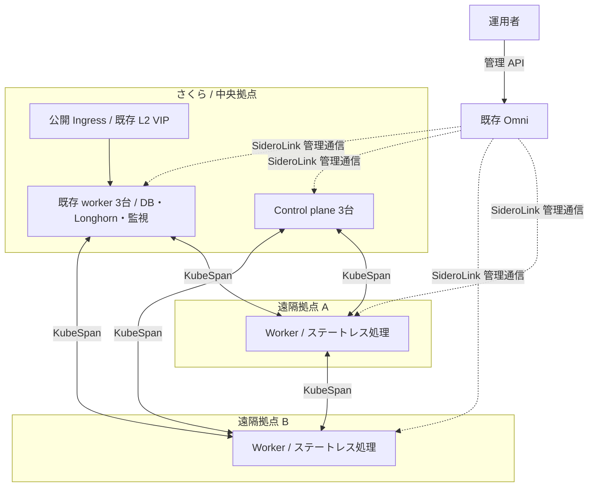

# Omni / KubeSpan による複数拠点へのノード配置案

2026-10-01 作成。**設計案・未適用**。この文書の追加では本番設定、ノード数、ディスク容量を変更しない。
現行設定は同日時点のリポジトリを基準とする。遠隔回線・実機での通信検証は未実施。

## 提案

まずは **さくらに control plane・DB・ストレージ・公開入口を残し、遠隔拠点にステートレスな worker を追加する**。
管理は既存 Omni に集約し、クラスタ内の拠点間通信には Talos の KubeSpan を使う。
最初の用途は、再実行できるバッチや検証用アプリなど、回線断を許容できる処理とする。

「拠点のインターネットが切れても、そこでサービスを再起動・運用したい」場合は、
その拠点に独立クラスタを置いて同じ Omni で管理する案を選ぶ。
単一クラスタへの worker 追加だけでは、その独立性は得られない。

| 観点 | A: 既存 prod + 遠隔 worker（最初の候補） | B: 拠点ごとに独立クラスタ |
| --- | --- | --- |
| 向く用途 | 余剰計算資源、バッチ、中央依存を許容するアプリ | 拠点内サービス、回線断中も必要な処理 |
| control plane | 既存さくら側の3台 | 各拠点に用意。HA が必要なら3台を基本とする |
| 管理 | 同一 Kubernetes API / GitOps | 同一 Omni、Kubernetes API / GitOps はクラスタ別 |
| WAN 断 | API・中央サービスへの依存が途切れる | ローカル依存を完備すれば拠点内で継続可能 |
| 障害・信頼の境界 | 全拠点で共有 | クラスタごとに分離 |
| 運用負担 | 小さく始められるがネットワーク検証が必要 | クラスタ、監視、バックアップの管理対象が増える |

## 構成と通信経路



図は主要経路のみを示す。SideroLink はノードと Omni の管理用接続、KubeSpan は
ノード間の WireGuard 接続として扱う。Pod の拠点間通信をすべて Omni サーバ経由にする設計ではない。
KubeSpan によるハイブリッドクラスタは [Omni 公式手順](https://docs.siderolabs.com/omni/cluster-management/create-a-hybrid-cluster)にある。

### 回線・アドレス

- 各ノードから Omni の HTTPS API と SideroLink endpoint に到達できること。
  公式の標準は TCP 443 / UDP 51820 だが、**実際の公開 endpoint とポートを確認する**。
  これは管理接続の要件であり、KubeSpan のノード間通信の疎通確認を代替しない。
  [Omni Firewall and Egress Requirements](https://docs.siderolabs.com/omni/omni-cluster-setup/omni-firewall-egress-requirement)
- KubeSpan の peer 間 UDP 通信を、中央↔遠隔だけでなく遠隔↔遠隔でも検証する。
  NAT 配下での Omni 登録成功を、Pod 通信の成功と判断しない。CGNAT・対称 NAT・UDP 制限がある拠点は実測が必要。
  到達できなければ拠点ルータの VPN / 到達可能な UDP endpoint の用意、または B 案を再検討する。
  Omni を任意のデータ通信の中継サーバとしては見込まない。
- Node IP はクラスタ内で一意にする。現行中央ノードの `192.168.100.0/24`、
  Pod の `10.244.0.0/16`、Service の `10.96.0.0/12` と各拠点 LAN の重複を調査する。
  家庭・会場 LAN の同じアドレスをそのまま Node IP に採用しない。
- さくらの L2 を遠隔に延伸しない。遠隔の NIC 名が `eth0` / `ens3` でも、同じ L2 に参加していることにはならない。
- DNS、NTP、コンテナレジストリ、Talos イメージ取得先への到達性も確認する。
  IPv4 / IPv6、動的グローバル IP、回線帯域、MTU を拠点台帳に残す。

### Cilium と MTU

現行 Cilium values は kube-proxy replacement と KubePrism を利用し、
`routingMode` / `tunnelProtocol` / MTU は明示していない。
まず live の ConfigMap・経路・使用デバイスを取得し、その構成を検証クラスタで再現する。
KubeSpan と Cilium のカプセル化による実効 MTU・CPU 負荷・帯域への影響を測る。
小さい ping だけで判断せず、大きいパケット、TCP、UDP、DNS、Service 経由を試す。
native routing への変更や Cilium 側の暗号化追加を同時には行わない。

Talos 1.13 向けの最小設定例は以下。ただし、これだけを prod に適用する手順ではない。
peer discovery、広告アドレス、CNI 連携、フィルタは採用版で確認して設定を確定する。

```yaml
apiVersion: v1alpha1
kind: KubeSpanConfig
enabled: true
```

同一拠点通信の暗号化除外は性能測定後に検討する。最初から除外を入れて疎通問題を複雑にしない。

## 配置と障害時の扱い

以下のラベルは**新設案**。Omni のマシンラベルと Kubernetes Node ラベルは別に管理し、
後者を machine config で永続化する。既存ノードを先にラベル付けしてから配置制約を導入する。

| 属性 | 案 | 用途 |
| --- | --- | --- |
| 拠点 | `topology.kubernetes.io/region=sakura` / `site-a` | アプリの required node affinity、拠点別集計 |
| ノード用途 | `ictsc.net/node-purpose=core` / `edge` | 中央サービスと遠隔処理の区別 |
| ストレージ | `ictsc.net/storage=true`（中央 worker のみ） | Longhorn 関連コンポーネントの配置 |
| 遠隔 taint | `ictsc.net/edge=true:NoSchedule` | 許可した処理のみ遠隔で実行 |

- **CP / etcd:** 既存3台をさくらに維持する。PoC では WAN 越しに etcd を分散させない。
  この案は中央拠点全体の停止への対策ではない。
- **DB / Longhorn / Prometheus / Loki:** 中央に固定する。Longhorn は Pod の nodeSelector に加え、
  ノード・ディスクの replica scheduling と StorageClass の指定まで確認する。
  PVC を使うアプリも中央に固定し、遠隔 Pod から中央のブロックストレージを常用しない。
  既存ディスク容量を維持し、ノード追加で中央の容量不足が解消するとは見込まない。
- **遠隔処理:** taint の toleration と拠点の required affinity を両方指定する。
  toleration だけでは遠隔配置は保証されない。最初は PVC 不要で再実行可能な処理に限定する。
- **基盤 DaemonSet:** Cilium、必要な CSI node plugin、監視・ログ収集などの対応を個別に確認する。
  edge taint により必須エージェントまで停止させない。CoreDNS 等の基盤サービスは中央で冗長化する。
- **公開入口:** 既存のさくら Ingress を維持する。遠隔アプリへの転送には WAN が必要。
  拠点内アクセスを完結させたい場合は B 案と拠点専用入口を設計する。

Cilium L2 Announcement は `nodeSelector` で中央の広告可能ノードに限定する。
現在は NIC 名だけで絞っており、遠隔を参加させる前に変更が必要。
ARP/NDP による公開はローカル LAN に対するものなので、遠隔ノードを leader 候補に含めない。
[Cilium L2 Announcements](https://docs.cilium.io/en/stable/network/l2-announcements/)

| 障害 | A 案で期待する挙動 / 制限 |
| --- | --- |
| 遠隔 WAN 断 | 実行中コンテナが残る場合もあるが、API・中央 DNS・DB 依存を含めサービス継続は保証しない |
| 分断中の再配置 | Node NotReady と eviction / toleration の設定に従う。残存処理と再配置先が重複しても安全な設計にする |
| WAN 復旧・IP 変更 | peer 再接続と Node Ready 復帰、アプリ復旧を試験する |
| 中央拠点停止 | 遠隔に worker があっても control plane と中央データは利用できない |
| Omni のみ停止 | 管理経路に影響。既存クラスタの動作と、新規参加・再接続時の挙動を分けて試験する |

B 案でも、ローカルの control plane だけではオフライン運用は完結しない。
DNS、必要なイメージ、Secret、ストレージ、入口などの依存を拠点内に用意する必要がある。

## 現行リポジトリから必要になる変更

| 対象 | 現状 | 実装時の変更案 |
| --- | --- | --- |
| `omni/clusters/prod/cluster.tf` の nodes | 6台固定、CP3 / worker3、external/internal IP 必須 | CP3を維持し、中央 worker と遠隔 worker を区別。拠点・インストールディスク・ネットワーク方式を表現 |
| 同 common patch | 全ノード `/dev/vda`、Node IP を `192.168.100.0/24` に限定 | 共通部分と機種・拠点別部分を分割。CP の etcd サブネットは中央のまま |
| 同 network patch | 全ノードがさくら用生成 YAML を使用 | 遠隔向け NIC / DHCP / 静的 IP 設定を別系統で管理 |
| `talos/patches/worker.yaml` | 全 worker に Longhorn mount と UserVolumeConfig | 中央 storage worker のみに適用。遠隔の追加ディスクを自動初期化しない |
| `manifest/envs/prod/resources/cilium-l2-announcement.yaml` | NIC 名のみ指定 | 中央ノード限定の nodeSelector を追加 |
| `manifest/envs/prod/values/longhorn.yaml` | worker role で選択 | 中央 storage worker 限定にし、replica / disk scheduling も制限 |
| DB・監視・既存アプリの values / workload | 拠点の区別なし | 中央 affinity を追加し、遠隔を既存アプリの意図しない移動先にしない |
| Cilium values / Omni patch | KubeSpan 用の明示設定なし | 検証済みの設定だけを版・測定結果とともに追加 |

Terraform の既存リソースアドレスを維持し、既存ノードの削除・再登録を伴わない変更にする。
遠隔実機のディスクはモデル・シリアル・対象を確認して選択し、さくら用 `/dev/vda` を流用しない。

## セキュリティと運用

- 遠隔 worker も prod クラスタの信頼境界に入る。管理者や物理アクセスを信頼できない拠点は B 案に分離する。
  Namespace / NetworkPolicy だけを、侵害されたノードとの強い隔離境界として扱わない。
- join token、登録情報を含む起動媒体、Secret は Git に置かない。配布・回収・失効手順を用意する。
- Talos API をインターネットに一律公開しない。既存 CP の 6443 は現在の方針を維持し、
  KubePrism と初期参加の経路を実証する前に閉じない。[API 公開方針](api-exposure.md)
- ノード名、拠点、管理者、機種、ディスク、回線、現地復旧手段を台帳化する。
  遠隔アップグレードは1台ずつ行い、起動失敗時の現地操作またはリモートコンソールを確保する。
- 拠点別 Node Ready、peer 状態、RTT・損失、ディスク、ログ転送停止を監視する。
  回線断1件で同じ原因のアラートが大量発生しないよう、拠点単位で集約する。
- ノード数増加で peer 関係・監視対象が増える。帯域・CPU・メモリを測り、台数上限を決める。

## 段階導入と完了条件

1. **事前棚卸し:** 拠点、回線、実機、CIDR、用途を決定。現行 Cilium / Node IP / firewall を取得し、
   etcd とアプリデータのバックアップ・復旧手順を確認する。
   現運用で判明した Omni の定期 etcd backup の S3 未設定は、本番導入前に解消・取得検証する。
2. **隔離した検証クラスタ:** 中央相当ノード + 遠隔1台で Talos / Cilium を prod と揃えて試す。
   遠隔2拠点目を加え、遠隔同士の通信も確認する。prod 全体への KubeSpan 有効化を最初の実験にしない。
3. **配置保護:** 既存ノードにラベルを付け、中央限定の L2 広告・ストレージ・アプリ配置を先に適用。
   既存サービス、DB、PVC に意図しない再配置・削除がないことを確認する。
4. **本番 canary:** Terraform plan の既存リソース削除・置換がゼロであることを確認。
   検証済みネットワーク設定を段階適用し、taint 付き遠隔1台と専用の検証 workload だけで開始する。
5. **継続観測:** 通常負荷を含む24〜48時間を目安に観測する（期間は暫定）。合格した拠点を1つずつ追加する。

| 検証 | 合格条件 |
| --- | --- |
| 通常通信 | 全拠点ペアの Node / Pod、Service、DNS、API が成功。採用する NetworkPolicy も期待どおり |
| パケットと性能 | 大きいパケット・TCP/UDP が継続動作。RTT p95、損失、帯域、CPU を記録し、対象アプリの要求を満たす |
| 障害注入 | 検証環境で WAN 断・復旧、外側 IP 変更、ノード再起動を実施し、手動経路修正なしで復旧 |
| 配置 | 遠隔に DB / Longhorn replica / 中央専用 Pod がない。遠隔が L2 VIP の leader にならない |
| データ保護 | 既存ディスクの初期化・削除なし。バックアップ取得と復旧確認が完了 |
| 監視 | 拠点障害と復旧を観測でき、中央サービスへの影響を区別できる |

アプリの遅延・帯域要件は未確定なので、現時点で一律の RTT 合格値は置かない。
測定値とアプリ要件を PoC 記録に追記してから本番可否を判断する。

### 撤退手順

遠隔 workload を停止・中央へ戻し、到達可能なら cordon / drain してから、対象 worker のみを
Omni / Terraform の管理手順に従って外す。到達不能ノードは、残存処理の重複実行とデータの有無を確認し、
必要なら電源断・認証失効で隔離してから再配置する。既存 CP や PVC を削除しない。

KubeSpan 設定を戻す場合は、まず全 workload と既存ノードの中央 LAN 経路が成立する状態へ戻す。
その後、検証済みの順序でパッチを戻して Node / Cilium / DNS / Ingress / DB を確認する。
配置保護のラベル・制約は残せる。単に遠隔ノードを抜いた直後に全体のネットワーク設定を一括反転しない。

## 実装前に決めること

- 最初の拠点数、各拠点の台数・CPU architecture・ディスク・現地管理者。
- NAT / CGNAT の有無、UDP 制限、CIDR、帯域、固定 IP やルータ設定変更の可否。
- 置きたい workload と、回線断で停止してよい範囲。拠点内完結が必須なら B 案を優先する。
- 外部公開を中央経由にするか、拠点固有の入口が必要か。
- prod と同じ信頼境界に入れてよい機材・拠点か。

最初の成果物は「遠隔2拠点で疎通・切断復旧を確認した PoC 記録」とし、
その結果を踏まえて本番用の Terraform / Talos / GitOps 差分を作る。
